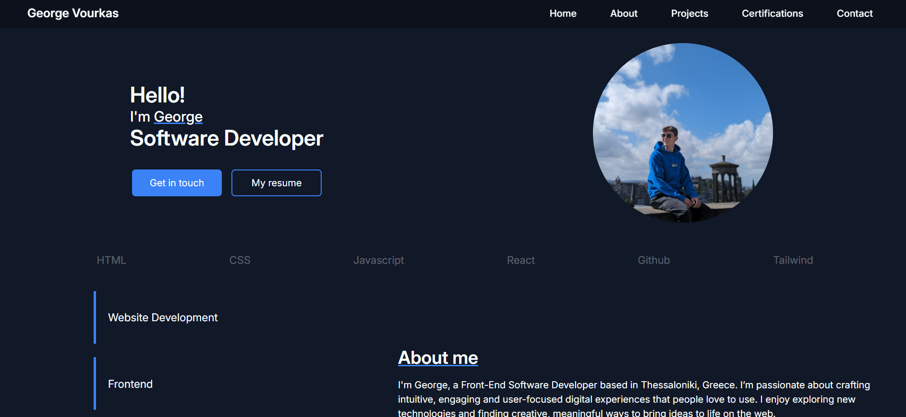

# 🌐 Personal Portfolio Website

This is my personal portfolio website built to showcase my projects, skills, and experience as a Front-End Developer.  
The website is designed with a clean, modern UI and fully responsive layout using **HTML**, **Tailwind CSS**, and **JavaScript**.

---

## Features

- Responsive design for all devices  
- Smooth scrolling and interactive navigation  
- Clean and minimal layout  
- Project showcase section  
- Contact section with direct links to email and social media  

---

## Technologies Used

- **HTML5**  
- **Tailwind CSS**  
- **JavaScript (Vanilla)**  

---

## Screenshot

---

## 🌍 Live Demo

🔗 [View Portfolio Website](https://georgevourkas.com)

---

